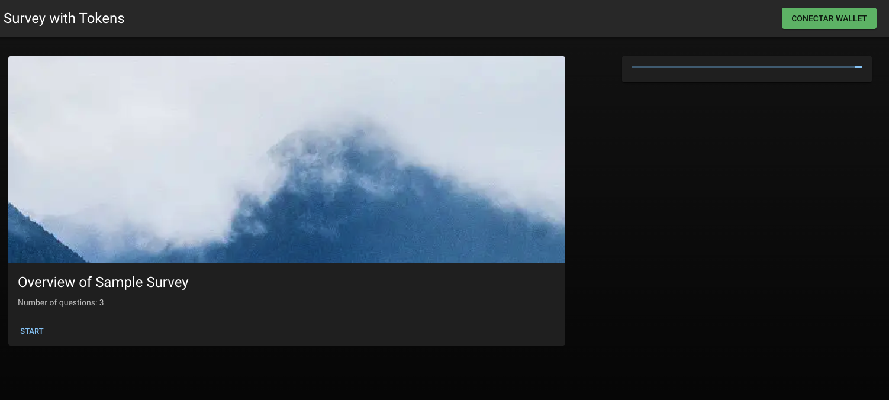
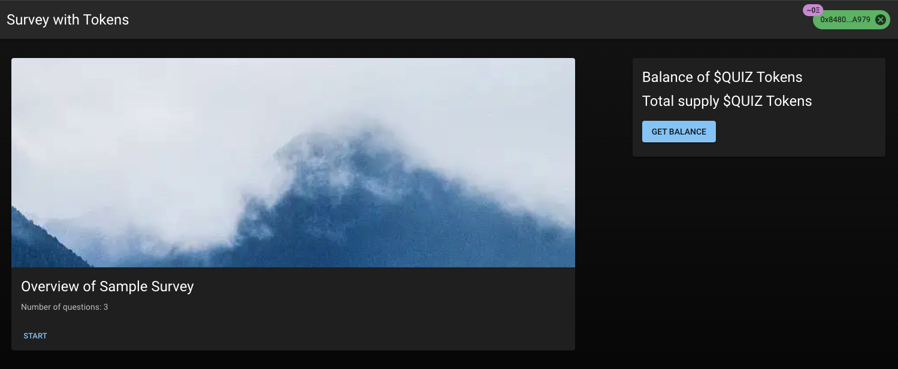
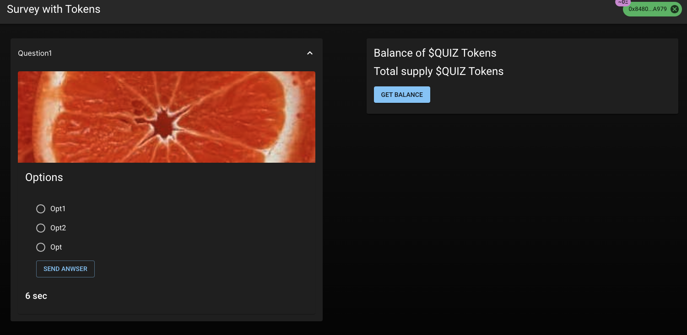
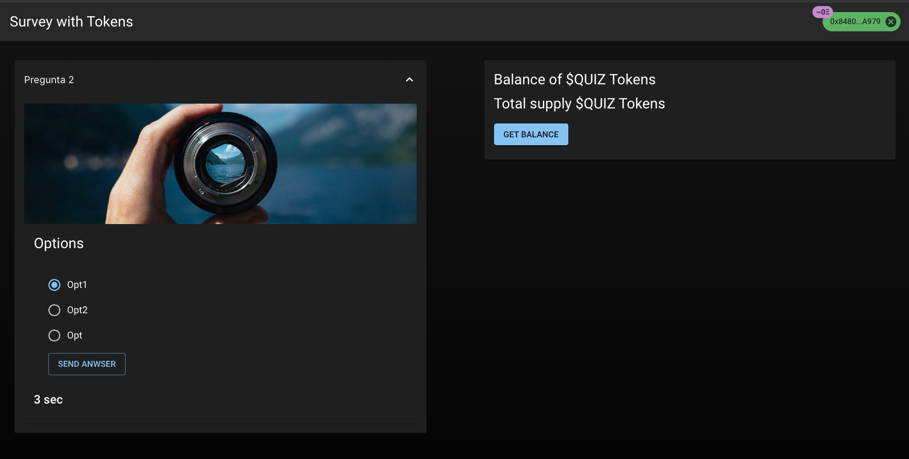
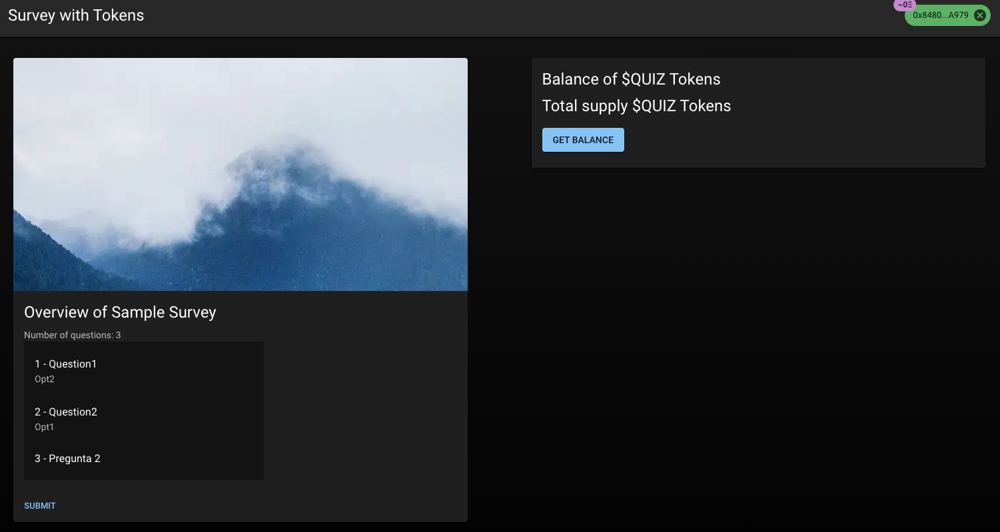
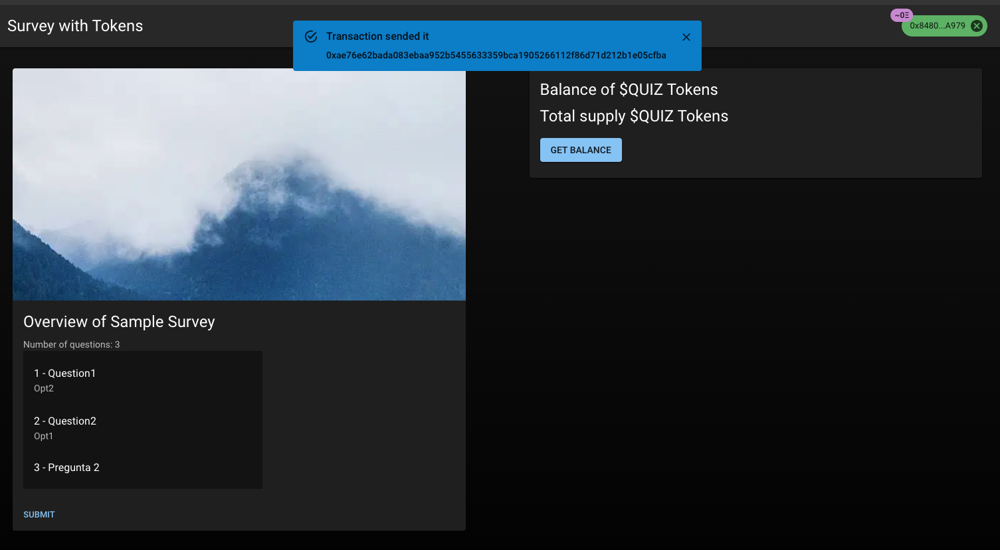

# Web3 Survey

Web3 Challenge by Edgar A Guevara.

## Introduction

This project is a responsive web application developed using React and TypeScript for people to participate in surveys and earn tokens in the process. It connects to the Ethereum blockchain using Web3 technology and interacts with smart contracts to reward users with tokens for completing surveys.

## Getting Started

To run the project locally, follow these steps:

1. Clone this repository to your local machine.
2. Install dependencies using npm:

    ```bash
    npm install
    ```

3. Start the development server:

    ```bash
    npm run dev
    ```

4. Open [http://localhost:3000](http://localhost:3000) in your browser to see the application.

## Technologies Used

- [React](https://react.dev/)
- [Next.js](https://nextjs.org/)
- [React Query](https://react-query.tanstack.com/)
- [Material UI](https://mui.com/)
- [web3.js](https://web3js.readthedocs.io/)
- [web3-react](https://github.com/Uniswap/web3-react)
- [web3-react-connector](https://github.com/Uniswap/web3-react/blob/v6/docs/connectors/README.md)

## Challenge Brief

A survey company wants to create a new quiz form that rewards users with tokens for participating in the survey. This project fulfills the requirements outlined in the challenge brief.

## Features

- Connect Metamask wallet.
- Ensure the user is connected to the Goerli network.
- Show the balance of the $QUIZ token.
- Present the daily trivia with its picture and allow users to begin answering.
- Display each question with a timer.
- Move to the next question once answered or expired.
- Show an overview of all answers.
- Submit the questions to the validator contract.
- Refresh the balance of $QUIZ token.

## Evaluation Criteria

The project will be evaluated based on the following criteria:

- Aesthetic, clean code (use linter).
- Sensible folder structure (hexagonal architecture).
- Scalable solution.
- Well-documented Readme file including explanations on environment variables required for running the project.
- Include pictures or videos showing the project working.
- Deploy the application to Vercel, Netlify, or any other free hosting service for quick testing.

## Additional Resources

- [Survey Contract Repository](https://github.com/rather-labs/blockchain-challenge-utils)
- [Survey Sample](https://github.com/rather-labs/blockchain-challenge-utils/blob/main/survey-sample.json)
- [Smart Contract of $QUIZ token](https://goerli.etherscan.io/address/0x437ef217203452317c3c955cf282b1ee5f6aaf72)
- [Material UI Documentation](https://mui.com/)

---

## Additional Content












